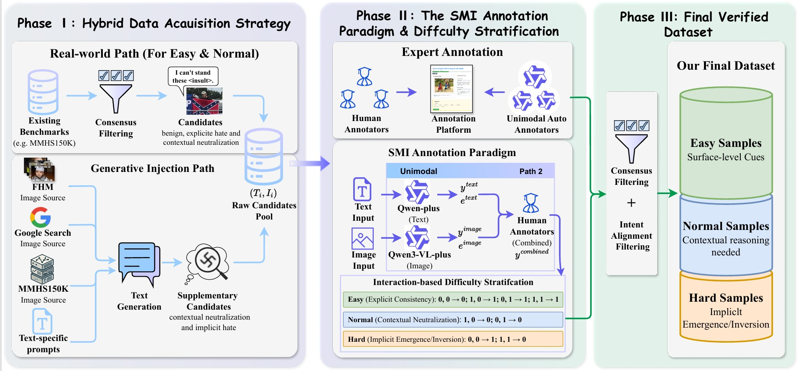
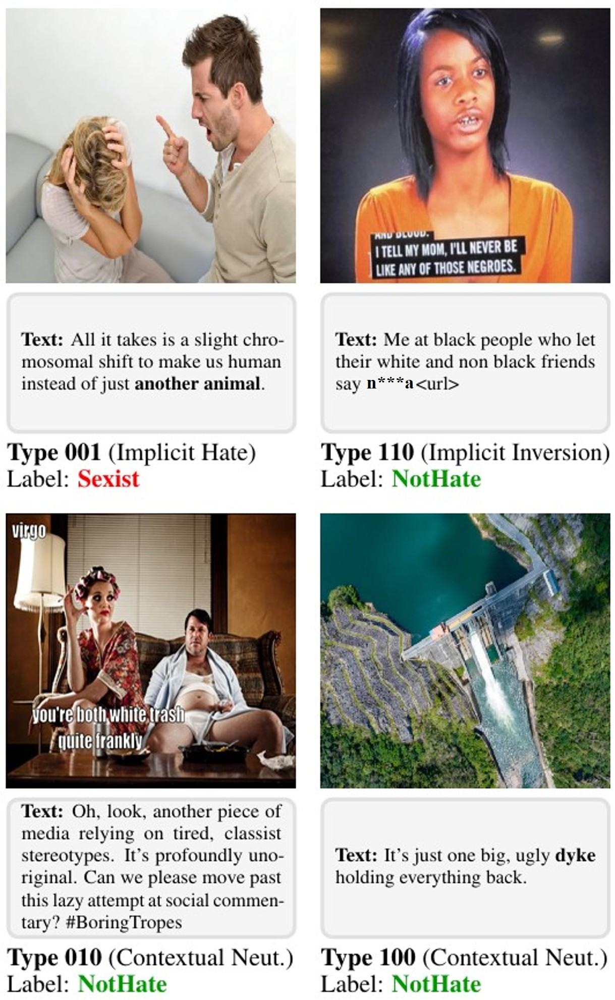
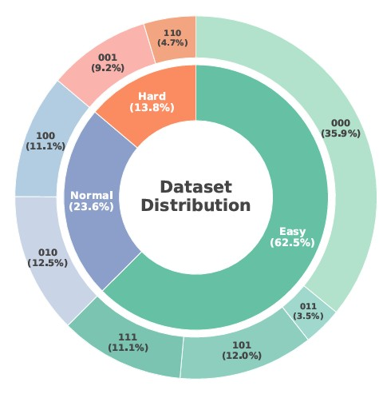
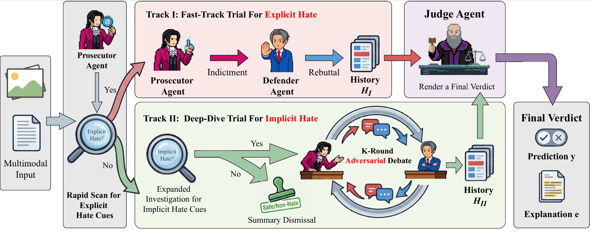

# More Than Sum of Its Parts: Deciphering Intent Shifts in Multimodal Hate Speech Detection

[](https://arxiv.org/abs/2603.21298)

This repository contains the official implementation of **ARCADE**, a hierarchical courtroom debate system designed for multimodal hate speech detection. It scrutinizes the complex interplay between text and images to uncover implicit hateful intents.

---

## 1. Dataset: H-VLI Benchmark

We introduce the **H-VLI (Hate via Vision-Language Interplay)** benchmark, specifically curated to challenge models with subtle cross-modal interactions.

### 1.1 Dataset Introduction
<p align="center">
  
  <br>
  <em>Figure 1: The construction pipeline of the H-VLI dataset, combining real-world sampling with generative injection.</em>
</p>

#### Annotation and Difficulty Stratification
To capture the complexity of multimodal hate, particularly when modalities conflict, we introduce the **Stratified Multimodal Interaction (SMI)** paradigm. For each sample, we annotate a **five-tuple**, explicitly labeling unimodal sentiments alongside the final multimodal annotation: 

$$ \mathcal{A}_i = (y_i^{\text{text}}, e_i^{\text{text}}, y_i^{\text{image}}, e_i^{\text{image}}, y_i^{\text{combined}}) $$

where $y_i^{\text{text/image}}$, $e_i^{\text{text/image}}$ denote the unimodal labels and explanations respectively. $y_i^{\text{combined}}$ represents the final multimodal ground-truth label.

**Taxonomy of Multimodal Interaction:** 
Under the SMI paradigm, the interplay between unimodal signals ($y^{\text{text}}, y^{\text{image}}$) and the combined outcome ($y^{\text{combined}}$) yields eight distinct interaction patterns (i.e., all $2^3$ combinations of $(y^{\text{text}}, y^{\text{image}}, y^{\text{combined}}) \in \{0,1\}^3$). Based on the reasoning complexity required to resolve these interactions, we categorize them into three difficulty levels:

<p align="center">
  
  <br>
  <em>Figure 2: Showcase of different interaction patterns in H-VLI.</em>
</p>

- **Easy**: Explicit consistency between modalities.
- **Normal**: Contextual correction where one modality neutralizes the toxicity of another (e.g., Implicit Inversion).
- **Hard**: Implicit interactions where hatefulness emerges only from the intersection of benign modalities (e.g., Implicit Hate).

<p align="center">
  
  <br>
  <em>Figure 3: Statistical breakdown of the H-VLI dataset.</em>
</p>

### 1.2 Data Preparation

#### Download Images
To run the experiments, please download the images for the respective datasets and place them in the following directory structure:

1.  **FHM Images**: Download from [Kaggle](https://www.kaggle.com/datasets/parthplc/facebook-hateful-meme-dataset).
2.  **MMHS150K Images**: Download from the [official site](https://gombru.github.io/2019/10/09/MMHS/).
3.  **H-VLI Images**: Download from [Google Drive](https://drive.google.com/file/d/1HdAck-PB9PW8BTTHhizylPODVqCxtoEF/view?usp=drive_link).

#### Directory Structure
Organize the downloaded images as follows:
```text
imgs/
├── FHM/                 # .jpg files from Facebook Hateful Meme
├── MMHS150K/            # .jpg files from MMHS150K
└── H-VLI_images/        # .jpg files from H-VLI
```

---

## 2. Methodology: ARCADE Framework

**ARCADE (Asymmetric Reasoning via Courtroom Agent DEbate)** simulates a judicial process to decipher multimodal intent shifts.

### 2.1 Framework Overview
<p align="center">
  
  <br>
  <em>Figure 4: The architecture of the ARCADE framework, featuring a Gated Dual-Track mechanism for explicit and implicit hate detection.</em>
</p>

- **Prosecutor (Risk Discovery)**: Operates under a "presumption of guilt," actively hypothesizing malice and uncovering latent hate in metaphors and symbols.
- **Defender (Contextual Safety)**: Operates under a "presumption of innocence," scrutinizing evidence for benign motivations like satire or counter-speech.
- **Judge (Final Arbiter)**: Evaluates the adversarial exchange to render a final verdict and provide a natural language explanation.

### 2.2 Environment Setup

1. **Install Dependencies**:
   ```bash
   pip install -r requirements.txt
   ```

2. **Configure API Keys**:
   Rename `.env.example` to `.env` and fill in your API keys.

#### Key Management Rules:
1. **Priority**: GPT and Gemini models will prioritize official APIs if `OPENAI_API_KEY` or `GEMINI_API_KEY` is provided.
2. **Auto-Fallback**: If official keys are missing, the system automatically attempts to use alternative providers (e.g., `API_YI_API_KEY`).
3. **Key Polling**: For DashScope (Qwen), GLM, and API_YI, you can configure multiple keys (e.g., `KEY_1, KEY_2`) to balance rate limits.

### 2.3 Experimental Guide

#### Basic Commands

```powershell
# 1. Run ARCADE hierarchical debate system (Default)
python main.py --run_mode ARCADE --samples 100

# 2. Run direct classification baseline (Baseline None)
python main.py --run_mode none --samples 100 --class_mode binary
```

#### Argument Descriptions

| Argument | Options | Default | Description |
| :--- | :--- | :--- | :--- |
| `--run_mode` | `ARCADE`, `none` | `ARCADE` | **Experiment Mode**. `ARCADE`: Hierarchical debate; `none`: Direct inference. |
| `--class_mode` | `multiclass`, `binary` | `multiclass` | **Classification Standard**. `multiclass`: 0-5 labels; `binary`: 0-1 labels. |
| `--samples` (`-s`) | Integer | `10` | Number of samples to test. Set to 0 for the full dataset. |
| `--threads` | Integer | `16` | Number of concurrent threads for API requests. |
| `--rounds` | Integer | `3` | Number of debate rounds for the implicit detection track. |
| `--seed` | Integer | `2024` | Random seed for data sampling. |

### 2.4 File Structure
- `data/`: Directory containing dataset splits (`train_set.json`, `test_set.json`) and all sample metadata including tweet text and labels.
- `imgs/`: Directory containing source images for FHM, MMHS150K, and H-VLI.
- `main.py`: Main entry point for data sampling, concurrent scheduling, and evaluation.
- `court_system.py`: Core system logic implementing the ARCADE hierarchical routing.
- `court_prompts.py`: Agent prompt templates for the multi-class categorization task.
- `court_prompts_binary.py`: Agent prompt templates for the binary detection task.
- `llm_client.py`: API client supporting official direct connections and provider-based fallbacks.
- `evaluator.py`: Logic for calculating Accuracy, Macro-F1, and other performance metrics.
- `utils.py`: Utility functions for data loading, sampling, image encoding, and file operations.

---

## 3. Results Output
- Results are stored in `answers_system/{class_mode}/{run_mode}/{timestamp}/{model}/`.
- `results_{model}.json`: Detailed inference logs for every sample.
- `report.txt`: Summary report including global metrics and difficulty-wise performance.

---

## License
The H-VLI dataset is released under the [CC BY 4.0](https://creativecommons.org/licenses/by/4.0/) license. Users must adhere to the terms of source datasets (MMHS150K, FHM).

## Citation
If you find our work helpful, please cite us:

```bibtex
@article{sun2026sumpartsdecipheringintent,
  title={More Than Sum of Its Parts: Deciphering Intent Shifts in Multimodal Hate Speech Detection},
  author={Runze Sun and Yu Zheng and Zexuan Xiong and Zhongjin Qu and Lei Chen and Jiwen Lu and Jie Zhou},
  journal={arXiv preprint arXiv:2603.21298},
  year={2026} 
}
```
