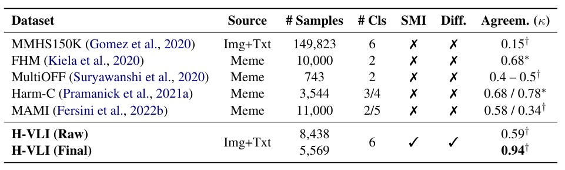

# More Than Sum of Its Parts: Deciphering Intent Shifts in Multimodal Hate Speech Detection

[]()

<p align="justify">
  <b>Abstract:</b> <font color="grey">Combating hate speech on social media is critical for securing cyberspace, yet relies heavily on the efficacy of automated detection systems. As content formats evolve, hate speech is transitioning from solely plain text to complex multimodal expressions, making implicit attacks harder to spot. Current systems, however, often falter on these subtle cases, as they struggle with multimodal content where the emergent meaning transcends the aggregation of individual modalities. To bridge this gap, we move beyond binary classification to characterize semantic intent shifts where modalities interact to construct implicit hate from benign cues or neutralize toxicity through semantic inversion. Guided by this fine-grained formulation, we curate the Hate via Vision-Language Interplay (H-VLI) benchmark where the true intent hinges on the intricate interplay of modalities rather than overt visual or textual slurs. To effectively decipher these complex cues, we further propose the Asymmetric Reasoning via Courtroom Agent DEbate (ARCADE) framework. By simulating a judicial process where agents actively argue for accusation and defense, ARCADE forces the model to scrutinize deep semantic cues before reaching a verdict. Extensive experiments demonstrate that ARCADE significantly outperforms state-of-the-art baselines on H-VLI, particularly for challenging implicit cases, while maintaining competitive performance on established benchmarks. Our code and data will be released.</font>
</p>

This repository contains the official implementation of **ARCADE**, a hierarchical courtroom debate system designed for multimodal hate speech detection. It scrutinizes the complex interplay between text and images to uncover implicit hateful intents.


---

## 1. Methodology: ARCADE Framework

**ARCADE (Asymmetric Reasoning via Courtroom Agent DEbate)** simulates a judicial process to decipher multimodal intent shifts.

<p align="center">
  
  <br>
  <em>Figure 1: The architecture of the ARCADE framework, featuring a Gated Dual-Track mechanism for explicit and implicit hate detection.</em>
</p>

- **Prosecutor (Risk Discovery)**: Operates under a "presumption of guilt," actively hypothesizing malice and uncovering latent hate in metaphors and symbols.
- **Defender (Contextual Safety)**: Operates under a "presumption of innocence," scrutinizing evidence for benign motivations like satire or counter-speech.
- **Judge (Final Arbiter)**: Evaluates the adversarial exchange to render a final verdict and provide a natural language explanation.

## 2. Dataset: H-VLI Benchmark

We introduce the **H-VLI (Hate via Vision-Language Interplay)** benchmark, specifically curated to challenge models with subtle cross-modal interactions.

<p align="center">
  
  <br>
  <em>Figure 2: The construction pipeline of the H-VLI dataset, combining real-world sampling with generative injection.</em>
</p>

H-VLI categorizes samples into three difficulty levels based on the **Stratified Multimodal Interaction (SMI)** paradigm:
- **Easy**: Explicit consistency between modalities.
- **Normal**: Contextual correction where one modality neutralizes the toxicity of another.
- **Hard**: Implicit interactions where hatefulness emerges only from the intersection of benign modalities.

<p align="center">
  
  <br>
  <em>Figure 3: Statistical breakdown of the H-VLI dataset.</em>
</p>

<p align="center">
  
  <br>
  <em>Figure 4: Comparison of H-VLI with existing multimodal hate speech datasets.</em>
</p>

<p align="center">
  
  <br>
  <em>Figure 5: Representative samples from H-VLI showcasing various interaction patterns.</em>
</p>

---

## 3. File Structure
- `main.py`: Main entry point for data sampling, concurrent scheduling, and evaluation.
- `court_system.py`: Core system logic implementing the ARCADE hierarchical routing.
- `court_prompts.py`: Agent prompt templates for the multi-class categorization task.
- `court_prompts_binary.py`: Agent prompt templates for the binary detection task.
- `llm_client.py`: API client supporting official direct connections and provider-based fallbacks.
- `evaluator.py`: Logic for calculating Accuracy, Macro-F1, and other performance metrics.

## 4. Environment Setup

1. **Install Dependencies**:
   ```bash
   pip install -r requirements.txt
   ```

2. **Configure API Keys**:
   Rename `.env.example` to `.env` and fill in your API keys.

### Key Management Rules:
1. **Priority**: GPT and Gemini models will prioritize official APIs if `OPENAI_API_KEY` or `GEMINI_API_KEY` is provided.
2. **Auto-Fallback**: If official keys are missing, the system automatically attempts to use alternative providers (e.g., `API_YI_API_KEY`).
3. **Key Polling**: For DashScope (Qwen), GLM, and API_YI, you can configure multiple keys (e.g., `KEY_1, KEY_2`) to balance rate limits.

## 5. Experimental Guide

### Basic Commands

```powershell
# 1. Run ARCADE hierarchical debate system (Default)
python main.py --run_mode ARCADE --samples 100

# 2. Run direct classification baseline (Baseline None)
python main.py --run_mode none --samples 100 --class_mode binary
```

### Argument Descriptions

| Argument | Options | Default | Description |
| :--- | :--- | :--- | :--- |
| `--run_mode` | `ARCADE`, `none` | `ARCADE` | **Experiment Mode**. `ARCADE`: Hierarchical debate; `none`: Direct inference. |
| `--class_mode` | `multiclass`, `binary` | `multiclass` | **Classification Standard**. `multiclass`: 0-5 labels; `binary`: 0-1 labels. |
| `--samples` (`-s`) | Integer | `10` | Number of samples to test. Set to 0 for the full dataset. |
| `--threads` | Integer | `16` | Number of concurrent threads for API requests. |
| `--rounds` | Integer | `3` | Number of debate rounds for the implicit detection track. |
| `--seed` | Integer | `2024` | Random seed for data sampling. |

## 6. Results Output
- Results are stored in `answers_system/{class_mode}/{run_mode}/{timestamp}/{model}/`.
- `results_{model}.json`: Detailed inference logs for every sample.
- `report.txt`: Summary report including global metrics and difficulty-wise performance.

---

## License
The H-VLI dataset is released under the [CC BY 4.0](https://creativecommons.org/licenses/by/4.0/) license. Users must adhere to the terms of source datasets (MMHS150K, FHM).

## Citation
If you find our work helpful, please cite us:

```bibtex

```
